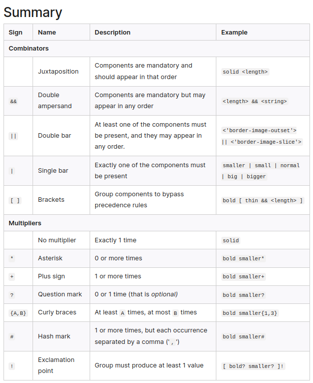

# info-from-sources

<details>
<summary>
  
`good default reset` [css reset by joshwacomeau](https://www.joshwcomeau.com/css/custom-css-reset/)
</summary>
  
```css
/*
  Josh's Custom CSS Reset
  https://www.joshwcomeau.com/css/custom-css-reset/
*/
*, *::before, *::after {
  box-sizing: border-box;
}
* {
  margin: 0;
}
body {
  line-height: 1.5;
  -webkit-font-smoothing: antialiased;
}
img, picture, video, canvas, svg {
  display: block;
  max-width: 100%;
}
input, button, textarea, select {
  font: inherit;
}
p, h1, h2, h3, h4, h5, h6 {
  overflow-wrap: break-word;
}
#root, #__next {
  isolation: isolate;
}
```

</details>

<br>

## [css-tricks](https://css-tricks.com/fun-viewport-units/)  
difference between % and vw is most similar to the difference between em and rem. A % length is relative to local context (containing element) width, while a vw length is relative to the full width of the browser window.

```css
html {
  font-size: 62.5%; // base to 10px
}

body {
  font-size: 2.1rem; // this is 21px
}
```
## `youtube video explaining where one should use what unit generally` [kevin powell, Are you using the right CSS units?](https://www.youtube.com/watch?v=N5wpD9Ov_To)
- use `%` for max-width for width
- 1 `ch` = width of 'o' in any font, 45-70 ch is a good width
- for padding btns use `em` because the if you increase the padding the font size will grow with them
- for text margins use `em` as for headers it will be respectively more, giving good whitespaces etc
- for media queries, use `em` 
- for shadows, border etc use `px`

## [popular font stack on css-tricks](https://css-tricks.com/snippets/css/system-font-stack/)

```html
body {
  font-family: system-ui, "Segoe UI", Roboto, Helvetica, Arial, sans-serif, "Apple Color Emoji", "Segoe UI Emoji", "Segoe UI Symbol";
}
```
<br>

## Reading the formal syntax of css

`all the nooks and quirks of the formal grammar syntax with a quick symmary` [mdn docs for formal syntax](https://developer.mozilla.org/en-US/docs/Web/CSS/Value_definition_syntax)

<br>



Reading formal syntax for CSS can be a bit tricky at first, but once you understand the notation, it becomes easier to follow. Here's a breakdown of how to read CSS formal syntax:

1. **Value Definitions**:
   - `||` means "or" (e.g., `<length> || <percentage>` means a value can be either a length or a percentage).
   - `&&` means "and" (e.g., `<'border-width'> && <'border-style'> && <'border-color'>` means all three values are required).
   - `?` means optional (e.g., `[ <'border-top-width'> || <'border-left-width'> ]?` means these values are optional).
   - `*` means zero or more occurrences (e.g., `<line-width>*` means zero or more occurrences of `<line-width>`).
   - `+` means one or more occurrences (e.g., `<length>+` means one or more occurrences of `<length>`).
   - `#` means "the preceding value can be repeated" (e.g., `<color>#` means the `<color>` value can be repeated).

2. **Formal Syntax Values**:
   - `<length>` represents a length value (e.g., `10px`, `2rem`).
   - `<percentage>` represents a percentage value (e.g., `50%`).
   - `<color>` represents a color value (e.g., `#ff0000`, `rgb(255, 0, 0)`, `red`).
   - `<url>` represents a URL value (e.g., `url(image.jpg)`).
   - `<integer>` represents an integer value (e.g., `5`).
   - Values enclosed in angle brackets (`< >`) represent data types or syntax placeholders.

3. **Grouping**:
   - Square brackets `[ ]` are used to group items together.
   - Parentheses `( )` are used to group complex expressions.

4. **Literal Values**:
   - Values enclosed in single quotes `' '` represent literal values (e.g., `'border-width'`).

5. **Comments**:
   - `/* ... */` is used for multi-line comments.
   - `//` is used for single-line comments.

Here's an example of a formal syntax for the `border` property:

```
border: <line-width> || <line-style> || <'color'>
```

This syntax means that the `border` property can take one, two, or three values. The first value can be a `<line-width>` (e.g., `2px`), the second value can be a `<line-style>` (e.g., `solid`), and the third value can be a literal `'color'` (e.g., `'red'`).

By understanding the notation used in formal syntax, you can better comprehend how CSS properties and values should be structured and used.


## [background css shorthand formal syntax](https://developer.mozilla.org/en-US/docs/Web/CSS/background)

Sure, here's a more concise and easier-to-read syntax for the `background` property in CSS:

```
background: <bg-layer> [, <bg-layer>]* [, <final-bg-layer>]?;

<bg-layer> =
  <bg-image> |
  <position> / <bg-size>? |
  <repeat-style> |
  <attachment> |
  <box> <box>?;

<final-bg-layer> =
  <bg-image> |
  <position> / <bg-size>? |
  <repeat-style> |
  <attachment> |
  <box> <box>? |
  <bg-color>;

<bg-image> = <url> | <gradient> | none;
<position> = [left|center|right|<length>] [top|center|bottom|<length>];
<bg-size> = <length> <length>? | cover | contain;
<repeat-style> = repeat-x | repeat-y | [repeat|space|round|no-repeat]{1,2};
<attachment> = scroll | fixed | local;
<box> = border-box | padding-box | content-box;
<bg-color> = <color>;
```

In this syntax:

- `background` is a shorthand property that accepts one or more `<bg-layer>` values, optionally followed by a `<final-bg-layer>`.
- `<bg-layer>` can be a `<bg-image>`, `<position> / <bg-size>?`, `<repeat-style>`, `<attachment>`, or a combination of two `<box>` values.
- `<final-bg-layer>` can be any of the values allowed for `<bg-layer>`, plus a `<bg-color>`.
- `<bg-image>` can be a URL, gradient, or the keyword `none`.
- `<position>` defines the background image's position with keyword values or lengths.
- `<bg-size>` sets the background image's size with lengths or the keywords `cover` or `contain`.
- `<repeat-style>` defines how the background image repeats.
- `<attachment>` determines if the background image scrolls or is fixed.
- `<box>` specifies which box area the background should be clipped to.
- `<bg-color>` sets the background color.

This syntax is more compact and easier to read, while still capturing the essential structure and valid values for the `background` property.


### entire syntax is being followed 
```css
//          bg-img             position / bg-size    repeat-style attachment box box
background: url("pattern.png") 20px 30px/100px 200px repeat-x fixed padding-box content-box, 
            linear-gradient(to bottom, #fff, #ccc) center/cover no-repeat border-box,
            #f0f0f0;
```

## Element Positioning 

`Really good article` [css tricks positioining guide](https://css-tricks.com/absolute-relative-fixed-positioining-how-do-they-differ/)

`

while using fixed for `nav` one can use
```html
h3 {
  scroll-margin-top: 5rem; /* whatever is a nice number that gets you past the header */
}
```
[ Css fix text below header ](https://css-tricks.com/fixed-headers-and-jump-links-the-solution-is-scroll-margin-top/)

## The CSS functions

- `min()` - resolves to the smallest unit given in the args
- `max()` - resolves to the largest unit given in the args
- `clamp()` - for clamp the value would be stuck between range, no matter what the prefered value is. if pref value is lower than low-end than it would clamp to that or to high-end if pref value is  higher than high-end
- `calc()` - 

for example, 
`margin-top: max(20vh, 2rem)` in this the margin on pc would be 20vh as its probably larger than 2rem whcih is 16*2px but on phones the rem would be larger as the screen is not big enough
`width: min(500px, 100vw)` for pc it would be 500px but for phones it would be 100vw as it is smaller than 500px

clamp() is a great way to make elements fluid and responsive. clamp() takes 3 values:
```
h1 {
  font-size: clamp(320px, 80vw, 60rem);
}
```
the smallest value (320px)
the ideal value (80vw)
the largest value (60rem)
The clamp() CSS function uses these values to set the smallest value, ideal value and largest value. In the above example, this would mean the smallest acceptable font-size would be 320px and the largest would be 60rem. The ideal font-size would be 80vw.


for viewports max is useful to keep the biggest size for readability/accessibility etc 
