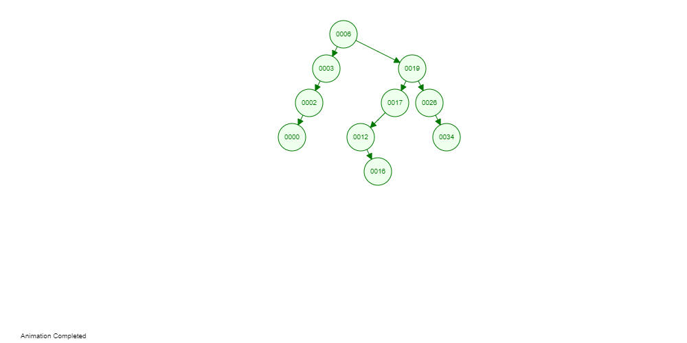

# Binary search tree

A straightforward method is used to create the binary search tree.

`[6, 3, 19, 2, 17, 26, 0, 34, 12, 16]`

`6` is the root node
`3` is less than root so its left of the root node
`19` is greater than root node so its right of root node
`2` is lesser root node and than the parent node `3` so its left of it
`17` is greater than the root node so its left child of `19` 

### Breadth first search

- Each levels are viewed at once

### Depth first search

1.  Preorder **D**LR (node, left right)
2.  Inorder L**D**R (left, node, right)
3.  Postorder LR**D** (left, right, node)

[Important video explaining bfs and dfs](https://www.youtube.com/watch?v=9RHO6jU--GU)