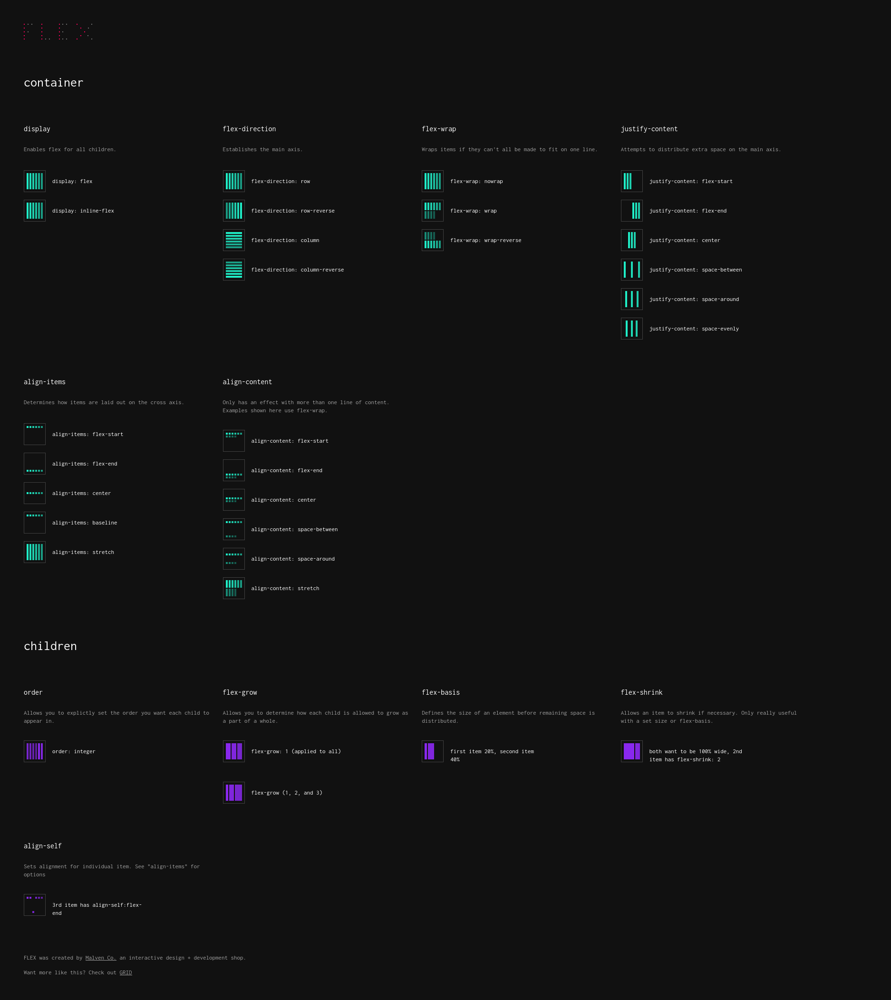

## Flexbox pointers

- Use `display: flex;` to create a flex container.
- Use `justify-content` to define the horizontal alignment of items.
- Use `align-items` to define the vertical alignment of items.
- Use `flex-direction` if you need columns instead of rows.
- Use the `row-reverse` or column-reverse values to flip item order.
- Use `order` to customize the order of individual elements.
- Use `align-self` to vertically align individual items.
- Use `flex` to create flexible boxes that can stretch and shrink.





### Tips & tricks

#### Sizing the elements in flex
- For fix width elements you can just omit the flex property and let it be const size while you can modify the flexible items with `flex:4` for example and it will only change size while other is fixed

- you can also use clamp() for the width of other element for resposiveness 
clamp(300px, 70%, 800px)

#### `flex-wrap`

```
width: 300px;

container < 900px or 750px

-------------------
|  0  |  1  |  2  |
-------------------
```

- this property by default is set to `nowrap` which ensures that when you give a fixed width to a element (width: 300px) and container is less than 900px wide than the elements are squeezed and ratio of the size it displayed

- making the `flex-wrap: wrap` makes the container do calculations and fit only as many as that could without any reduction to their size

```
------------------
|   0   |    1   |
------------------
|   2   |
---------
```

using `flex-wrap: wrap;` and then `width:300px` & `flex: 1 1 auto;` inside flex item does the same job as auto-fill 
*According to the W3 specification on auto-fill and auto-fit, both of these functions will return “the largest possible positive integer” without the grid items overflowing their container*
```
------------------
|   0   |    1   |
------------------
|       2        |
------------------
```

#### flex shorthand
```
        0     1     0
flex: grow shrink basis
```

#### flex-basis

basis is the size where grow and shrink intersects, if greater than basis than the growth ratio comes in effect or otherwise shrink does https://v2.scrimba.com/learn-flexbox-c0k/~09

#### aligning the flex-item using margin
For example. in this header div the `Logo` can be flexed to left by just using `margin-left:auto` without making two flex items one for logo and other for Right elements

```
Logo                                            About | Contacts 
```

```
margin-left: auto;
```
